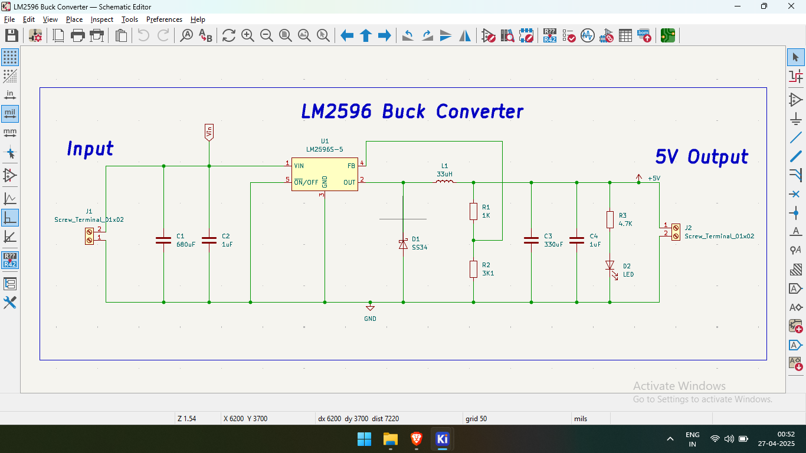
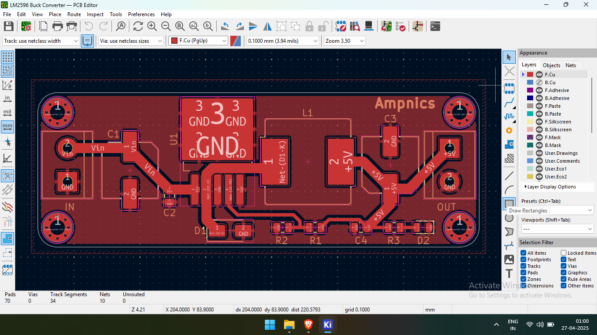
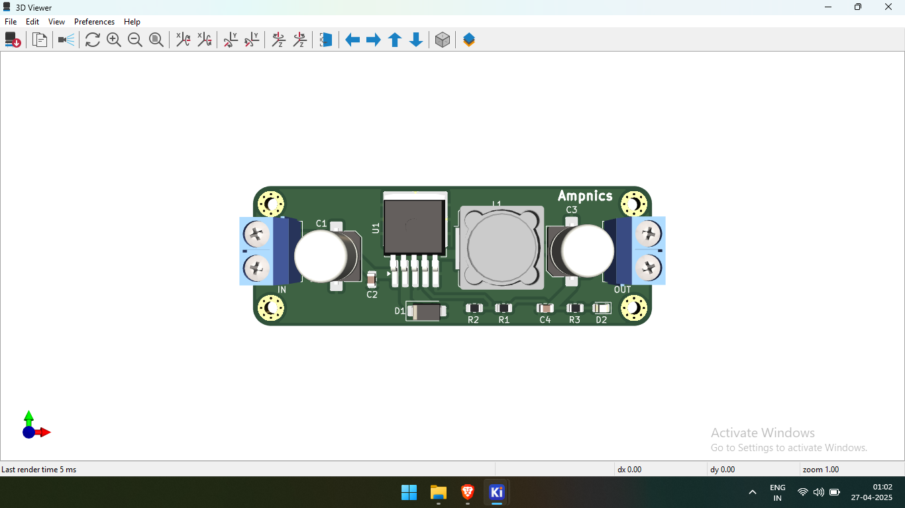

# ⚡ LM2596 5V Buck Converter PCB

## 📌 Overview  
This is a **PCB design** for a **5V Buck Converter**, created using **KiCad**. The circuit is based on the **LM2596S-5.0** fixed-voltage regulator and is ideal for efficiently stepping down higher DC voltages (like 7V–35V) to a stable 5V output for microcontrollers, sensors, and other electronics.

## 🛠️ Specifications  
- **Input Voltage**: 7V to 35V DC  
- **Output Voltage**: 5V DC (regulated)  
- **Regulator IC**: LM2596S-5.0  
- **Indicators & Filtering**:  
  - **Input Side**:  
    - 600µF and 1µF capacitors in parallel for input voltage filtering  
  - **Output Side**:  
    - 330µF and 1µF capacitors in parallel for output voltage smoothing  
    - LED with 4.7kΩ resistor (for output voltage indication)  
- **Protection & Efficiency**:  
  - SS34 Schottky diode for fast recovery and high efficiency  
  - 33µH inductor for stable current regulation  
- **Connectors**:  
  - Screw terminals for easy input and output connections

## 📂 Project Files  
- **Schematics** → `/Schematics/`  
- **PCB Layout** → `/PCB_Design/`  
- **Gerber Files** → `/Gerber_Files/` (for manufacturing)  
- **Images** → `/Images/` (renders & screenshots)  

## 🖼️ Preview Images  
| Schematic | PCB Layout | 3D Render |
|-----------|------------|-----------|
|  |  |  |

## 🔧 How to Use  
1️⃣ **Open the KiCad files** in `/Schematics/` and `/PCB_Design/`.  
2️⃣ **Review or customize the design** as per your requirements.  
3️⃣ **Generate the Gerber files** from `/PCB_Design/` and use `/Gerber_Files/` to order your PCB from a manufacturer.

## 🙏 Credits  
This project was created with the help of tutorials from the **[Ampnics YouTube Channel](https://youtube.com/playlist?list=PLxgq6Jtu7shQPHqYjKUVa28CmktTzHDLp&si=2TdaJywcDumlzVk_)**. Big thanks for their awesome content!

## 🔗 Links  
- 🚀 **Project Discussion on LinkedIn**: [LinkedIn](https://www.linkedin.com/posts/ramu-roy-b780382b7_pcbdesign-ams1117-voltageregulator-activity-7317076914295209984-Q4_r?utm_source=social_share_send&utm_medium=android_app&rcm=ACoAAEwAX4wBY70YZ3l58lvkiXtyCZcnWWrfJAA&utm_campaign=copy_link)  
- 📺 **Ampnics Tutorial Playlist**: [YouTube](https://youtube.com/playlist?list=PLxgq6Jtu7shQPHqYjKUVa28CmktTzHDLp&si=jp1xYo7E0JcdnXuT)

## 📜 License  
This project is licensed under the **MIT License** – feel free to use, share, and modify it!
